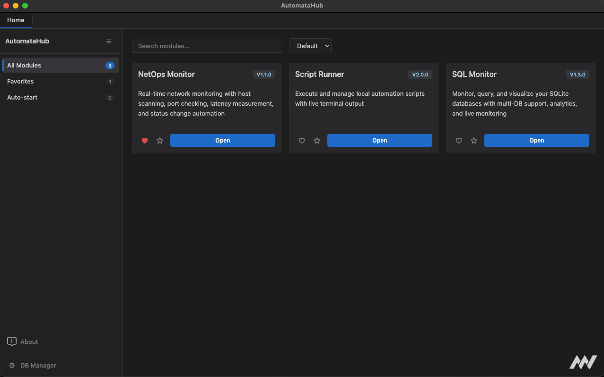
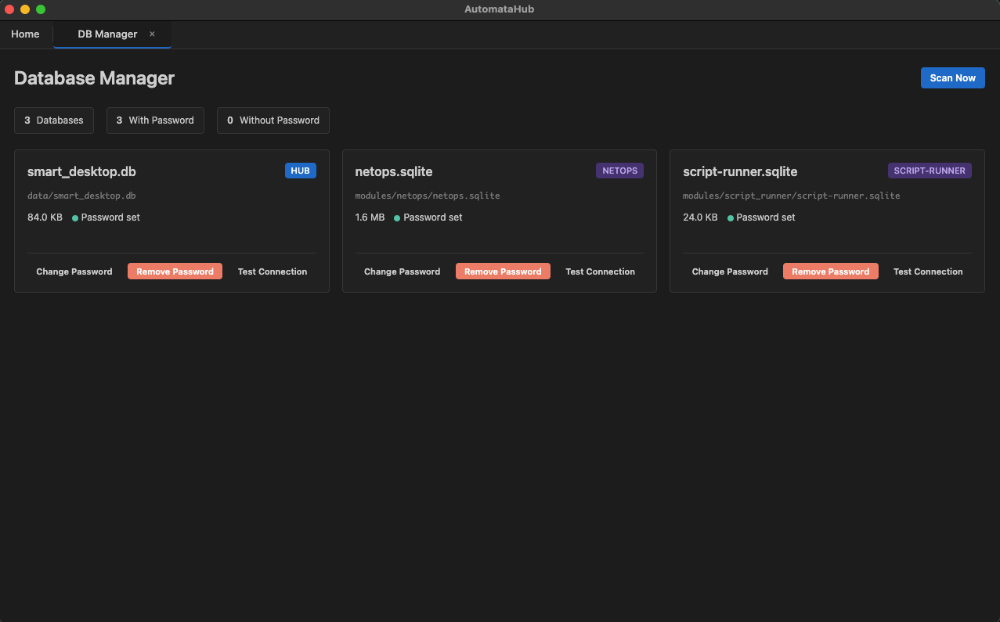
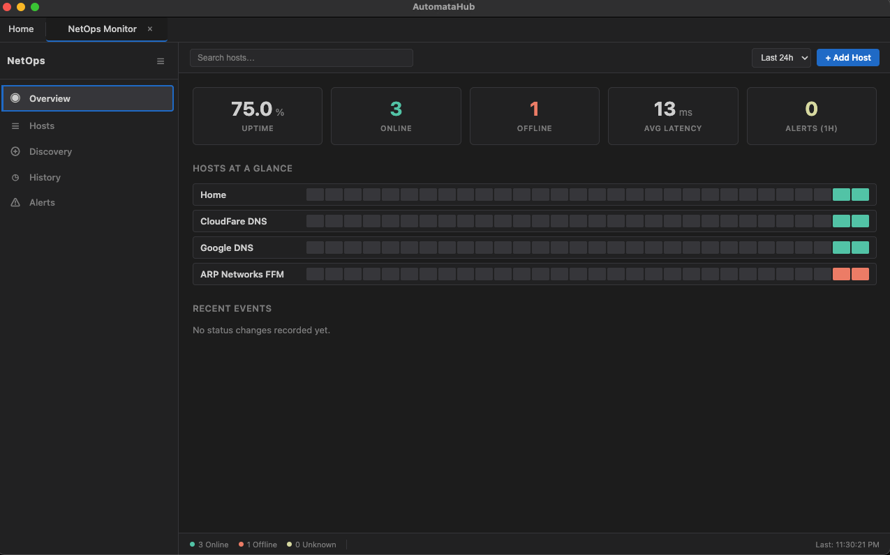
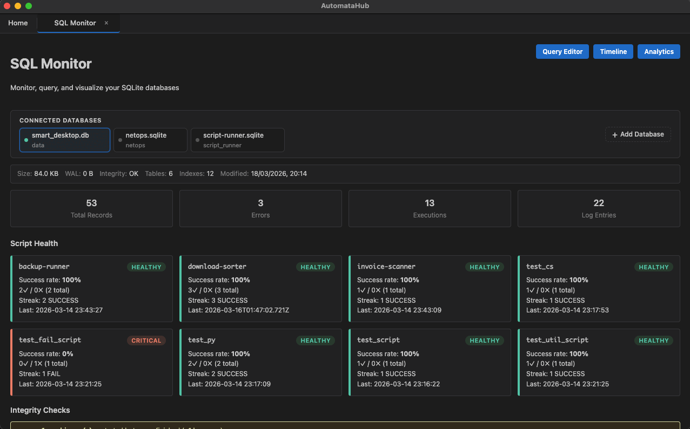

<p align="center">
  
</p>

<h1 align="center">AutomataHub</h1>

<p align="center">
  A modular Electron desktop hub for automation tools.<br/>
  Each capability — script execution, database visualization, network monitoring — is a self-contained module that plugs into the hub.
</p>

<p align="center">
  <a href="https://sonarcloud.io/summary/new_code?id=Rey-der_AutomataHub"></a>
</p>

---

## Quick Start

### Prerequisites

- **Node.js** 18+
- **npm** (comes with Node.js)

### Install & Run

```bash
git clone https://github.com/Rey-der/AutomataHub
cd AutomataHub
npm install
npm start
```

The hub opens with a dashboard showing installed modules. Click a module card to open it.

## Hub Features

### Home Dashboard

The landing page displays all installed modules as cards. Each card shows the module name, version, and description with controls for:

- **Favorites** — mark frequently used modules for quick access
- **Auto-start** — modules flagged as auto-start open their tabs automatically on launch
- **Filtering** — show all, favorites only, or auto-start only
- **Sorting** — default order, A-Z, or Z-A

<p align="center">
  
</p>

### Database Manager

A hub-level tool for managing database credentials across all discovered SQLite databases:

- **Database discovery** — scans the project tree and module directories for `.db`, `.sqlite`, and `.sqlite3` files
- **Password management** — set, change, or remove passwords per database using Electron's safeStorage (Keychain-backed encryption)
- **Connection testing** — verify credentials before saving
- **Source badges** — each database is tagged by origin (Hub, Module, or Project)
- **Initial password** — `0000` for all databases on first setup; change passwords through the database manager before production use

<p align="center">
  
</p>

### Tab System

Dynamic tabbed interface where each module registers its own tab types. Tabs can be created, switched, and closed independently. The hub manages tab lifecycle and routes events to the owning module.

### Inter-Module Communication

A secured event bus allows modules to communicate without direct coupling. Each module receives a **scoped, frozen bus handle** during setup that:

- Enforces an **event allowlist** — only declared event names (`module:activated`, `module:data-available`, etc.) can be emitted or listened to
- **Tags payloads** with the emitting module's ID for source tracking
- **Validates payloads** — only plain objects are accepted (blocks function/class injection)
- Prevents modules from impersonating other modules

## Modules

| Module | Description | Docs |
|--------|-------------|------|
| **Script Runner** | Execute, chain, schedule, and audit local automation scripts with live output, favorites, topic organization, and execution history | [README](modules/script_runner/README.md) |
| **NetOps Monitor** | Real-time network monitoring with host scanning, port checking, latency measurement, alert rules, and status tracking | [README](modules/netops/README.md) |
| **SQL Monitor** | Browse, query, and analyze SQLite databases with multi-DB support, a query editor, execution timeline, and RPA analytics | [README](modules/sql_visualizer/README.md) |

<details>
<summary><strong>Script Runner</strong></summary>
<p align="center">
  
</p>
</details>

<details>
<summary><strong>NetOps Monitor</strong></summary>
<p align="center">
  
</p>
</details>

<details>
<summary><strong>SQL Monitor</strong></summary>
<p align="center">
  
</p>
</details>

## Architecture

[](https://sonarcloud.io/summary/new_code?id=Rey-der_AutomataHub)
[](https://sonarcloud.io/summary/new_code?id=Rey-der_AutomataHub)
[](https://sonarcloud.io/summary/new_code?id=Rey-der_AutomataHub)
[](https://sonarcloud.io/summary/new_code?id=Rey-der_AutomataHub)
[](https://sonarcloud.io/summary/new_code?id=Rey-der_AutomataHub)

AutomataHub is a **hub + plugin** system:

- **Hub** — provides the shell: window management, tab system, module discovery, IPC bridge, shared utilities, and a CSS theming contract.
- **Modules** — provide features. Each module declares its IPC channels, tab types, and renderer scripts/styles in a `manifest.json`. The hub loads them automatically.

```
AutomataHub/
├── app/                        # Main process
│   ├── main.js                 # App entry, window, hub IPC handlers
│   ├── preload.js              # Secure IPC bridge (dynamic channel allowlist)
│   └── core/                   # Shared infrastructure
│       ├── module-loader.js    # Module discovery (modules/ + node_modules/)
│       ├── module-registry.js  # In-memory module metadata store
│       ├── ipc-bridge.js       # Scoped IPC handler registration with channel enforcement
│       ├── db-credentials.js   # Encrypted credential store (safeStorage)
│       ├── db-scanner.js       # SQLite database discovery
│       ├── user-prefs.js       # Persistent user preferences
│       ├── path-utils.js       # Safe path resolution (blocks traversal)
│       ├── config-utils.js     # JSON config reading with fallback
│       ├── event-bus.js        # Secured inter-module EventBus (allowlist + scoping)
│       └── errors.js           # Centralized error messages
│
├── renderer/                   # Renderer process — UI shell
│   ├── index.html              # Single-page app shell
│   ├── core.css                # Hub theme (CSS variables, layout, tabs)
│   ├── ui.js                   # Notifications & utilities
│   ├── tab-manager.js          # Dynamic tab types, creation, switching
│   ├── module-bootstrap.js     # Loads module scripts & styles at startup
│   └── pages/
│       ├── home-tab.js         # Hub dashboard
│       └── db-manager-tab.js   # Database credential management UI
│
├── modules/                    # Installed modules
│   ├── script_runner/          # → modules/script_runner/README.md
│   ├── netops/                 # → modules/netops/README.md
│   └── sql_visualizer/         # → modules/sql_visualizer/README.md
│
├── tests/                      # Unit tests
├── logs/                       # Saved execution logs
├── resources/                  # App icons & images
└── docs/                       # Design documentation
```

## Module System

### Discovery

The hub discovers modules from two sources:

1. **`modules/` directory** — any subfolder containing a `manifest.json`
2. **`node_modules/automatahub-*`** — any installed npm package matching the prefix with a `manifest.json`

Local modules take priority. If a module exists in both locations, the local version is used.

### Installing a module

**Clone into `modules/` for automatic discovery:**

```bash
cd modules && git clone <module-repo-url>
```

**Or install as an npm package:**

```bash
npm install automatahub-script-runner
```

### Creating a module

A minimal module needs:

```
my-module/
├── manifest.json       # Required: id, name, ipcChannels, tabTypes
├── main-handlers.js    # Optional: setup(context) and teardown()
├── renderer/
│   ├── my-tab.js       # Renderer scripts (registered via manifest)
│   └── styles.css      # Module styles (uses --hub-* CSS variables)
└── package.json
```

## Security

[](https://sonarcloud.io/summary/new_code?id=Rey-der_AutomataHub)
[](https://sonarcloud.io/summary/new_code?id=Rey-der_AutomataHub)

- Context isolation and sandbox enabled (no `nodeIntegration`)
- CSP headers: `default-src 'self'; script-src 'self'; style-src 'self' 'unsafe-inline'`
- **Scoped IPC bridges** — each module gets its own IpcBridge that only allows channels declared in its manifest
- **Three-gate IPC validation** — preload `invoke()` allowlist, preload `on()`/`off()` allowlist, and main-process bridge channel enforcement
- **Secured EventBus** — event allowlist, payload type validation, source tagging, and frozen per-module handles
- Database passwords encrypted at rest via Electron safeStorage (OS keychain)
- Path containment validation via `resolveInside()` — blocks path traversal
- All child processes spawned with `shell: false`
- PRAGMA key uses hex-encoded blob literals to prevent injection
- Secured EventBus architecture with strict channel control and validated event flow

## Security Audit

See **[SECURITY_AUDIT.md](SECURITY_AUDIT.md)** for the full audit report (last run: 23 March 2026).

Covers: Gitleaks · Trivy · npm audit · Semgrep (70 findings, 7 fixed) · Tests · .NET builds · JS syntax.

## Development

[](https://sonarcloud.io/summary/new_code?id=Rey-der_AutomataHub)
[](https://sonarcloud.io/summary/new_code?id=Rey-der_AutomataHub)

```bash
npm start     # Start the app
npm test      # Run unit tests
npm run build # Build distributable (requires electron-builder)
```

## Documentation

- [Architecture](docs/ARCHITECTURE.md) — Module system design and data flow
- [DOCUMENTATION.md](DOCUMENTATION.md) — Comprehensive technical reference
- [Script Runner](modules/script_runner/README.md) — Workspace overview, orchestration features, and screenshots
- [Automation script catalog](modules/script_runner/automation_scripts/README.md) — Bundled scripts, variants, and database usage

## License

ISC
