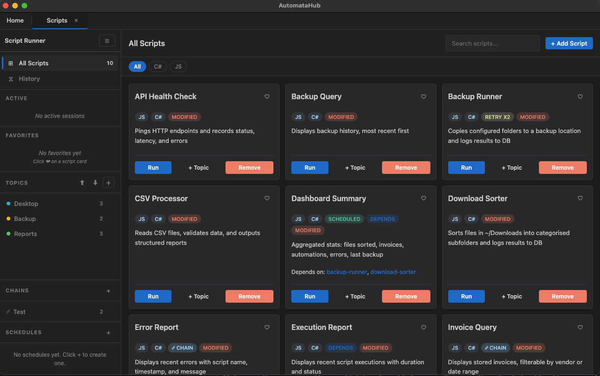

# automatahub-script-runner

> Process automation module for [AutomataHub](https://github.com/Rey-der/AutomataHub) — orchestrate, execute, and monitor automation scripts across multiple languages (JavaScript, C#, Python, Bash) with structured error handling, SQL-based audit logging, and live terminal output.

<p align="center">
  
</p>

## What It Does

A modular automation framework that discovers, queues, executes, and tracks local automation scripts — built from scratch as a self-contained plugin for the AutomataHub desktop platform.

- **Orchestrate** automation workflows with a sequential execution queue and real-time status feedback
- **Track every run** via structured SQL logging: execution status, durations, errors with stack traces, and per-operation audit records
- **Dual-language scripts** — each of the 8 bundled automations ships in both JavaScript and C#, sharing the same SQLite database
- **Organize** scripts into user-defined topics for categorization and filtering
- **Monitor** execution in real time with live stdout/stderr streaming, timestamps, and exportable logs

## Features

### Automation Engine
- **Process Queue** — Sequential execution queue with position tracking, visual indicators, and queue-depth feedback; ensures reliable serial processing of dependent workflows
- **Multi-Language Execution** — Spawns scripts via the appropriate interpreter: Node.js, .NET (`dotnet-script` for C#), Python, Bash, Ruby, Perl
- **Timeout and Signal Escalation** — Graceful SIGTERM with 5-second grace period, escalates to SIGKILL for hung processes; prevents zombie subprocesses
- **Environment Isolation** — Per-job environment variables injected at runtime, including database path (`SMART_DESKTOP_DB`) and script-specific config
- **Workflow Chaining** — Scripts can declare dependencies via `dependsOn` in config.json. Running a script with dependencies auto-resolves the full dependency tree (topological sort with cycle detection), executes each step sequentially in the same terminal, and skips downstream scripts if a dependency fails

### Error Handling and Logging
- **Three-Tier Error Tracking** — Every execution is recorded across three SQL tables:
  1. `execution_tracking` — start/end timestamps, SUCCESS/FAIL status, error messages
  2. `automation_logs` — granular INFO/SUCCESS/ERROR entries per operation with metadata
  3. `errors` — full exception details including stack traces for post-mortem analysis
- **runTracked() Wrapper** — Shared helper that wraps any script's main logic with automatic execution tracking, status updates, and database persistence on both success and failure
- **Partial Success States** — Operations like backups track SUCCESS/PARTIAL/FAIL to distinguish complete runs from partial completions

### SQL Database Layer
- **SQLite via sql.js (WASM)** — Zero native dependencies; works across Electron main process and Node.js child processes without recompilation
- **6 Structured Tables** — `automation_logs`, `execution_tracking`, `errors`, `file_processing_records`, `backup_history`, `invoices` — all with CHECK constraints and auto-timestamps
- **In-Memory + Periodic Flush** — Database loaded into memory on startup, flushed to disk every 60 seconds; `close()` persists on shutdown
- **Write-Through Consistency** — All state mutations immediately written to the in-memory store; periodic flush ensures durability

### Script Discovery and Organization
- **Auto-Discovery** — Scans `automation_scripts/` for script folders containing executable files (`.sh`, `.py`, `.js`, `.rb`, `.pl`, `.csx`)
- **Topic System** — Create custom topics with colors, assign scripts to topics, filter and reorder within topics
- **Import/Remove** — Add script folders via drag-and-drop or system file picker; remove with confirmation
- **config.json Support** — Each script folder can define name, description, entry-point, and environment variables
- **Persistent Storage** — Topics and associations stored in SQLite with auto-flush

### Bundled Automation Scripts

All 8 scripts ship with both a JavaScript and a C# implementation that share the same database schema:

| Script | What It Automates | Key Technique |
|--------|-------------------|---------------|
| **backup-runner** | Incremental folder backup with deduplication (size + mtime) | Partial-success tracking (SUCCESS/PARTIAL/FAIL) |
| **backup-query** | Displays backup history from database | SQL reporting with formatted output |
| **download-sorter** | Categorizes files by extension into 7 folders | Dry-run simulation mode (`DRY_RUN=1`) |
| **invoice-scanner** | Extracts vendor, amount, date from PDF documents | Regex-based data extraction + structured storage |
| **invoice-query** | Queries stored invoices by vendor or date range | Parameterized SQL queries, JSON output |
| **error-report** | Surfaces recent script errors for review | Audit trail / compliance logging |
| **execution-report** | Calculates execution history with run durations | Performance tracking and KPIs |
| **dashboard-summary** | Aggregates daily metrics across all scripts | Cross-system KPI dashboard (files sorted, invoices, errors) |

## Installation

### Option 1 — Local development

Clone into the hub's `modules/` directory:

```bash
cd AutomataHub/modules
git clone https://github.com/Rey-der/automatahub-script-runner script-runner
```

The hub auto-discovers it on startup.

### Option 2 — npm package

```bash
npm install automatahub-script-runner
```

The hub's module loader scans both `modules/` (dev priority) and `node_modules/automatahub-*` (production).

## Architecture

Built as a self-contained plugin following AutomataHub's modular architecture, with clean separation between orchestration, business logic, persistence, and presentation:

```
script_runner/
├── core/
│   ├── script-store.js          # In-memory data store (topics, scripts, associations)
│   └── script-persistence.js    # SQLite persistence via sql.js (in-memory + 60s flush)
├── handlers/
│   ├── scripts.js               # Script discovery, import, removal
│   ├── topics.js                # Topic CRUD (create, update, delete, list)
│   ├── organization.js          # Script-topic associations + reordering
│   └── execution.js             # Run/stop scripts, log export, queue state
├── monitoring/
│   └── script-executor.js       # Subprocess spawning, queue, lifecycle, signal escalation
├── automation_scripts/
│   ├── _lib/                    # Shared utilities (db.js, tracker.js, output.js)
│   ├── backup-runner/           # JS + C# implementations
│   ├── download-sorter/         # JS + C# implementations
│   ├── invoice-scanner/         # JS + C# implementations
│   └── ... (8 scripts total)    # Each with config.json + dual-language variants
├── renderer/
│   ├── script-app.js            # Root layout (sidebar + browser)
│   ├── script-topics.js         # Topic sidebar with CRUD dialogs
│   ├── script-browser.js        # Script cards, filtering, drag-and-drop import
│   ├── execution-tab.js         # Live terminal with real-time streaming
│   └── styles.css               # Component styles (--hub-* / --topic-* variables)
├── main-handlers.js             # Slim orchestrator (~60 lines): wiring only, no business logic
├── manifest.json                # Module metadata, IPC channels, renderer scripts
└── package.json
```

### Design Principles

- **Modular Handlers** — Each domain (scripts, topics, organization, execution) is a self-contained handler registered via `register(ipcBridge, deps)` — mirrors the separation of concerns in enterprise automation platforms
- **Dependency Injection** — Handlers receive shared dependencies (store, persistence, executor, send) at registration; promotes testability and loose coupling
- **Orchestrator Pattern** — `main-handlers.js` is ~60 lines: instantiates store, persistence, executor, wires handlers. Zero business logic — pure orchestration
- **Write-Through Persistence** — In-memory ScriptStore is the single source of truth; persistence layer writes through to SQLite for durability
- **Async WASM Persistence** — sql.js (WASM SQLite) eliminates native compilation issues across environments; in-memory DB flushed to disk every 60s
- **Real-Time Push** — Renderer components subscribe to IPC push channels for live updates on execution output, queue changes, and topic modifications
- **Component Lifecycle** — Renderer classes follow `init(container)` -> `render()` -> `destroy()` for predictable resource management

### How It Maps to RPA Concepts

| RPA / Enterprise Concept | Implementation in Script Runner |
|--------------------------|-------------------------------|
| Workflow Queue (Bot Orchestration) | Sequential execution queue with position tracking and depth feedback |
| Exception Handling + Recovery | `runTracked()` wrapper, 3-tier error tables, partial-success states |
| Process Audit Trail | `execution_tracking` + `automation_logs` with timestamps and metadata |
| Data Extraction (Document Processing) | `invoice-scanner`: PDF parsing with regex, structured DB storage |
| Incremental Processing | `backup-runner`: deduplication via size + mtime comparison |
| Dry-Run / Simulation | `download-sorter`: `DRY_RUN=1` mode previews file moves without execution |
| Cross-Language Orchestration | Single queue manages JS, C#, Python, Bash scripts via interpreter routing |
| KPI Aggregation + Monitoring | `dashboard-summary`: daily cross-script metrics (files, invoices, errors) |
| Composable Operation Logging | `file_processing_records`: each file operation tracked (sort/move/skip/delete/backup) |

## Script Folder Format

Each automation lives in its own subfolder under `automation_scripts/`, supporting multiple language variants:

```
automation_scripts/
  _lib/                   # Shared utilities (not listed as a script)
    db.js                 # WASM SQLite wrapper with table schemas
    tracker.js            # runTracked() execution tracking helper
    output.js             # Formatted JSON output helper
  backup-runner/
    config.json           # Name, description, env vars
    main.js               # JavaScript implementation
    csharp/
      Program.cs          # C# implementation (same DB schema)
      Script.csproj       # .NET project file
    README.md
```

**config.json**:

```json
{
  "name": "Backup Runner",
  "description": "Copies configured folders to backup location with incremental deduplication",
  "mainScript": "main.js",
  "retries": 2,
  "retryDelayMs": 3000,
  "schedule": "0 8 * * *",
  "dependsOn": ["download-sorter"],
  "env": {
    "BACKUP_FOLDERS": "~/Documents,~/Projects",
    "BACKUP_DEST": "~/Backups"
  }
}
```

| Field | Type | Default | Description |
|-------|------|---------|-------------|
| `name` | string | folder name | Display name in the UI |
| `description` | string | `""` | Script description |
| `mainScript` | string | first executable | Entry-point file |
| `retries` | number | `0` | Max retry attempts on failure (0 = no retry) |
| `retryDelayMs` | number | `3000` | Delay between retries in milliseconds |
| `schedule` | string | _(none)_ | Cron expression for automatic execution (5-field: `min hour day month weekday`) |
| `dependsOn` | string[] | `[]` | Script folder names that must run before this script (workflow chaining) |
| `env` | object | `{}` | Environment variables injected at runtime |

Without `config.json`, the folder name becomes the script name and the first executable file is used.

### Shared Library (`_lib/`)

The `_lib/` directory provides shared infrastructure for all automation scripts:

- **db.js** — Opens the SQLite database from `SMART_DESKTOP_DB` env var using sql.js (WASM); creates all 6 tables if missing; returns `all()`, `get()`, `run()`, `save()`, `close()` methods
- **tracker.js** — `runTracked(db, name, fn)` wraps script logic with execution tracking: inserts a start record, provides a `log(level, message)` callback, auto-updates status (SUCCESS/FAIL) on completion, and persists to DB
- **output.js** — `printJSON(data)` formats output for the Script Runner terminal display

## Supported Languages

| Extension | Interpreter | Notes |
|-----------|------------|-------|
| `.csx` | `dotnet-script` | C# scripts — all 8 bundled automations include C# variants |
| `.js`, `.mjs` | `node` | JavaScript — primary implementation language |
| `.py`, `.py3` | `python3` | Python scripts |
| `.sh`, `.bash` | `/bin/bash` | Shell scripts |
| `.rb` | `ruby` | Ruby scripts |
| `.pl` | `perl` | Perl scripts |

## IPC Channels

All channels namespaced as `script-runner:*`. The module exposes 20 IPC channels across 4 domains:

| Domain | invoke Channels | push Channels | Key Operations |
|--------|----------------|---------------|----------------|
| **Script Management** | 5 | 1 | Discovery, import, removal, folder validation |
| **Execution** | 4 | 4 | Run/stop scripts, save logs, live output streaming, queue status |
| **Topics** | 4 | 3 | CRUD for user-defined topics with cascade delete |
| **Organization** | 3 | 3 | Script-topic associations, reordering, bulk refresh |

Invoke channels use request-response via `ipcBridge.handle()`. Push channels broadcast real-time events to all renderer clients.

## Database Schema

All automation scripts share a single SQLite database with 6 tables:

| Table | Purpose | Key Columns |
|-------|---------|-------------|
| `execution_tracking` | Per-run audit trail | script, start_time, end_time, status (SUCCESS/FAIL), error_message |
| `automation_logs` | Granular operation logs | script, status (INFO/SUCCESS/ERROR), message, metadata |
| `errors` | Exception records | script, message, stack_trace |
| `file_processing_records` | Per-file operation log | source_path, dest_path, file_type, operation (sort/move/skip/delete/backup) |
| `backup_history` | Backup run summaries | folders, files_copied, files_skipped, status (SUCCESS/PARTIAL/FAIL) |
| `invoices` | Extracted invoice data | vendor, amount, invoice_date, file_path |

All tables use auto-incrementing IDs, `datetime('now', 'localtime')` default timestamps, and CHECK constraints for status enums.

## Tab Types

| Type | Component | MaxTabs | Purpose |
|------|-----------|--------|---------|
| `script-home` | ScriptApp | 1 | Main UI: topic sidebar + script browser with filtering |
| `script-execution` | ExecutionTab | 4 | Live terminal for running script |

## Data Flow

```
User Action (UI) -> IPC invoke() -> Handler.register() ->
  -> Modifies ScriptStore -> Calls persistence.save*() ->
  -> emit() broadcasts IPC push event -> Renderer components update() via listeners
```

All state changes flow through ScriptStore (single source of truth) with write-through to persistent storage.

## Testing

Run the full test suite from the module directory:

```bash
cd modules/script_runner
npm test
```

The suite uses Node.js built-in test runner (`node --test`) with no external test dependencies.

| Test File | Type | Tests | Coverage |
|-----------|------|-------|----------|
| `script-store.test.js` | Unit | 16 | ScriptStore CRUD: scripts, topics, associations, reordering, ID generation |
| `script-persistence.test.js` | Unit | 7 | ScriptPersistence: init, save/load round-trip, flush, close, remove |
| `script-discovery.test.js` | Integration | 8 | Script folder discovery: config parsing, variant detection, _lib exclusion |
| `script-execution.test.js` | Integration | 9 | ScriptExecutor: spawn lifecycle, stdout/stderr, queue, stop, retry, exit codes |

Tests create temporary directories and in-memory SQLite databases for full isolation — no external services or network access required.

## License

MIT
