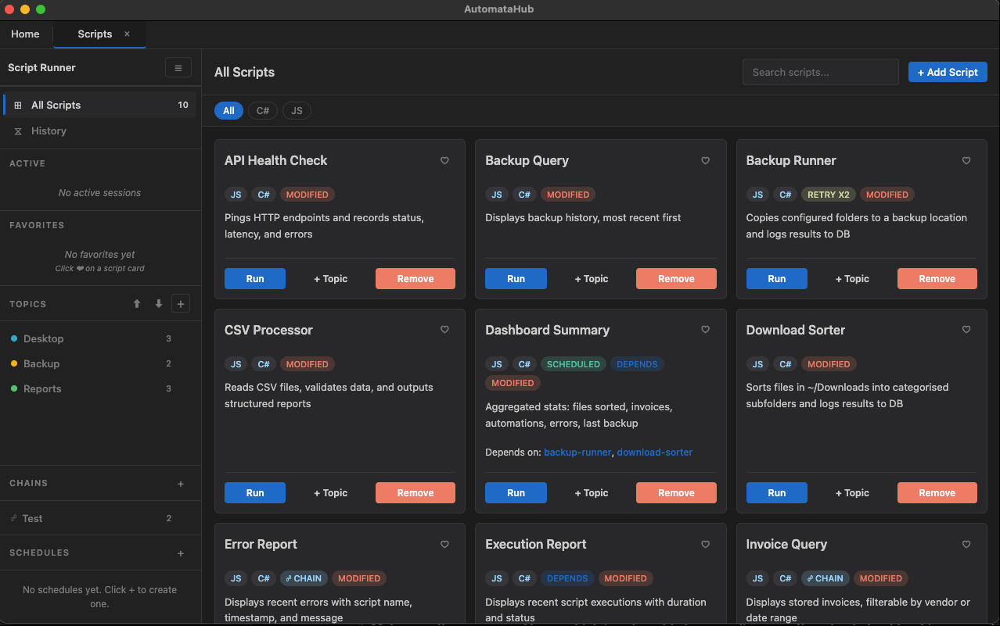
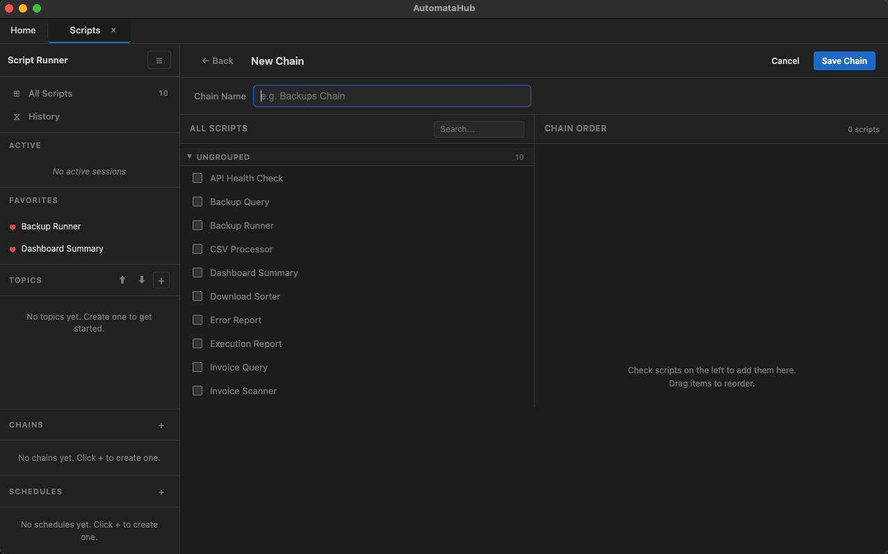
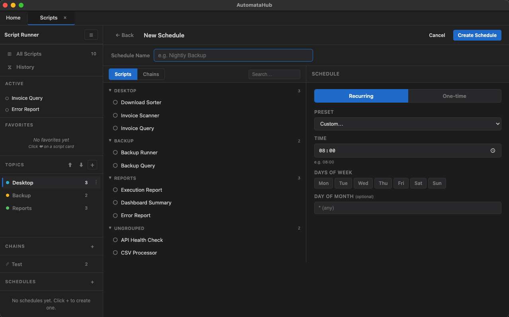
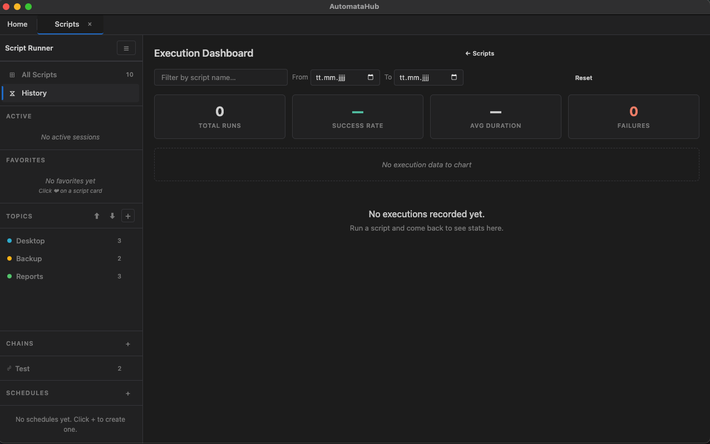

# automatahub-script-runner

> RPA-style automation workspace for [AutomataHub](https://github.com/Rey-der/AutomataHub) — run scripts, build workflow chains, schedule unattended execution, and track results from a single operator UI.

<p align="center">
  
</p>

## Overview

Script Runner is the process-automation module inside AutomataHub. It discovers local script folders, routes them to the correct interpreter, streams execution output in real time, and layers orchestration on top — chains, schedules, retries, and audit history — so individual scripts become manageable automated processes.

- **Operator workspace** — browser, active runs, history, favorites, chains, schedules, and topics in one layout
- **Workflow chains** — ordered multi-step automation sequences with step-level status tracking
- **Scheduled execution** — one-off and recurring runs via cron, surviving app restarts
- **Execution dashboard** — KPIs, timeline charts, and per-process breakdowns
- **Variant-aware** — a single process can expose JS, C#, Python, or shell implementations
- **Persistent organization** — topics, chains, schedules, and audit data saved across sessions

## Features

### Script Browser

The landing view is the day-to-day workspace for running and organizing automations.

- Process cards surface description, language variants, dependency badges, schedule badges, chain membership, and modified-state indicators
- Favorites are persisted locally and promoted into their own sidebar section
- Processes can be grouped by custom topics and refreshed from disk without leaving the module
- Import works through the folder picker and drag-and-drop validation
- Runs stay inside the module instead of spawning extra hub tabs

### Workflow Chains

Chains let you define ordered process sequences and run them as a guided workflow.

- Build chains from the full script catalog, including topic-grouped pickers
- Reorder steps with drag-and-drop before saving
- Run the full chain in a dedicated chain runner view
- Track step-by-step progress with status chips and per-script execution panes
- Stop the currently running chain without losing visibility into what already finished

<p align="center">
  
</p>

### Scheduled Automation

Schedules add unattended execution on top of individual processes and saved chains.

- Target either a single process or a saved chain
- Support one-time and recurring schedules
- Offer preset cron templates plus manual timing controls
- Allow enable/disable directly from the sidebar list
- Persist schedule definitions so they survive app restarts

<p align="center">
  
</p>

### Execution History

The module keeps a dedicated execution dashboard for auditing recent runs.

- Total runs, success rate, average duration, and failures at a glance
- Filter by script name and date range
- Timeline chart for successes vs failures over time
- Per-script breakdown table for volume and reliability trends
- Recent run history wired into the browser so script cards can show previous executions

<p align="center">
  
</p>

## Execution Model

Script Runner supports both single-process launches and orchestrated flows.

- **Interpreter routing** for `.js`, `.mjs`, `.cs`, `.csx`, `.py`, `.sh`, `.bash`, `.rb`, and `.pl`
- **Variant discovery** from root executables and executable subfolders
- **Live stdout/stderr streaming** into the execution view
- **Stop handling** for individual runs and active chain steps
- **Retry metadata** from `config.json` for scripts that define retry policies
- **Queue-aware execution state** so the UI can reflect active and completed runs consistently

## Bundled Automations

The module ships with a ready-to-run automation library under `automation_scripts/`:

| Script | Purpose |
| --- | --- |
| `api-health-check` | Probe HTTP endpoints and record availability and latency |
| `backup-query` | Read back stored backup history |
| `backup-runner` | Run incremental folder backups |
| `csv-processor` | Validate and summarize CSV imports |
| `dashboard-summary` | Aggregate daily automation metrics |
| `download-sorter` | Sort downloaded files into categorized folders |
| `error-report` | Review captured automation errors |
| `execution-report` | Review execution records and durations |
| `invoice-query` | Query stored invoice data |
| `invoice-scanner` | Extract invoice information from documents |

## Script Layout

Every discovered automation lives in its own folder and can expose one or more runnable variants.

```text
automation_scripts/
  _lib/
    db.js
    output.js
    tracker.js
  backup-query/
    config.json
    main.js
    csharp/
      config.json
      Program.cs
```

Key `config.json` fields:

| Field | Purpose |
| --- | --- |
| `name` | Display name in the UI |
| `description` | Summary shown on the card |
| `mainScript` / `main` | Preferred entry point |
| `env` | Runtime environment variables |
| `retries` | Retry count for failed runs |
| `retryDelayMs` | Delay between retries |
| `schedule` | Cron expression for scheduled execution |
| `dependsOn` | Script IDs that should run before this one |

## Persistence

Script Runner persists user-defined and operational data separately:

- **Discovered scripts** come from the filesystem on refresh
- **Topics, chains, and schedules** are saved through the module persistence layer
- **Execution audit data** is written into SQLite-backed automation tables
- **History dashboard state** is derived from recorded executions, not hard-coded demo data

## Module Structure

```text
script_runner/
├── core/
│   ├── script-store.js
│   └── script-persistence.js
├── handlers/
│   ├── scripts.js
│   ├── execution.js
│   ├── chains.js
│   ├── schedules.js
│   ├── topics.js
│   └── organization.js
├── monitoring/
│   ├── script-executor.js
│   └── scheduler.js
├── renderer/
│   ├── script-app.js
│   ├── script-browser.js
│   ├── script-chains.js
│   ├── script-schedules.js
│   ├── script-dashboard.js
│   └── execution-tab.js
└── automation_scripts/
```

## Development

From the repository root:

```bash
npm start
npm test
```

From the module directory:

```bash
cd modules/script_runner
node --test tests/
```

## Related Docs

- [AutomataHub root README](../../README.md)
- [Architecture notes](../../docs/ARCHITECTURE.md)
- [Automation script catalog](automation_scripts/README.md)
